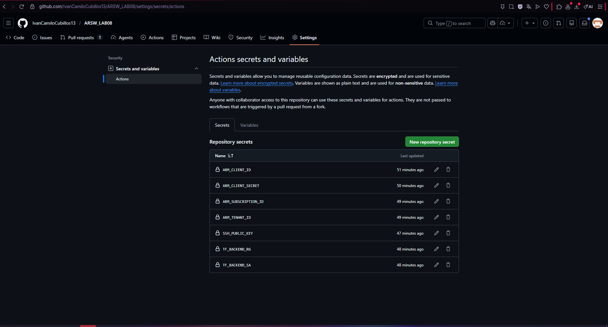
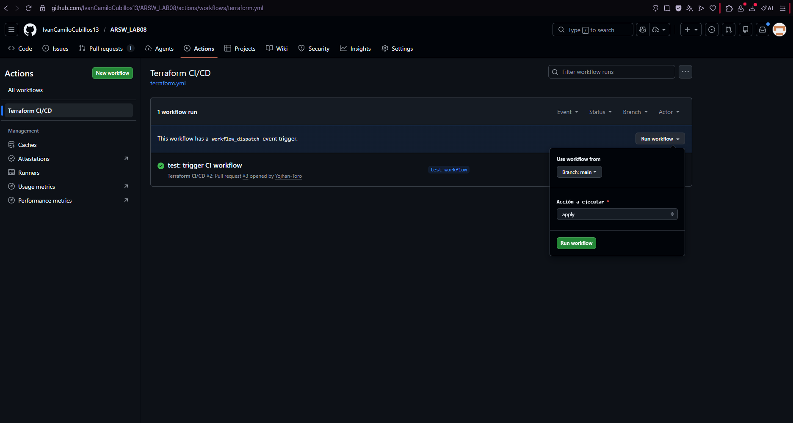
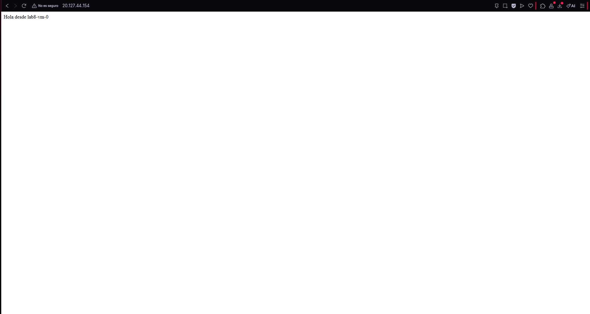
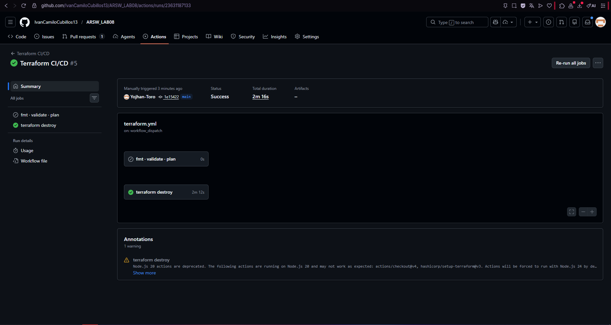

# Lab 8 — Infraestructura como Código con Terraform (Azure)

**Curso:** ARSW / BluePrints  
**Equipo:** Yojhan Toro, Ivan Cubillos
**Fecha:** 2026

## Descripción

Despliegue de una arquitectura de alta disponibilidad en Azure usando Terraform. 
Incluye un Load Balancer público, 2 VMs Linux con nginx, red virtual segmentada 
en subredes y NSGs, y estado remoto en Azure Storage.

## Arquitectura

- **Resource Group:** `lab8-rg`
- **VNet:** `lab8-vnet` (10.10.0.0/16)
  - `subnet-web` (10.10.1.0/24) — VMs detrás del Load Balancer
  - `subnet-mgmt` (10.10.2.0/24) — acceso de gestión
- **NSG web:** permite HTTP (80) desde Internet y SSH (22) solo desde IP autorizada
- **NSG mgmt:** permite SSH (22) solo desde IP autorizada
- **Load Balancer:** SKU Standard, IP pública estática, health probe TCP/80
- **VMs:** Ubuntu 22.04 LTS, nginx instalado via cloud-init
- **Remote State:** Azure Storage Account con bloqueo de estado

## Estructura del repositorio
```
LAB08/
├── infra/
│   ├── main.tf           # Resource Group y wiring de módulos
│   ├── providers.tf      # Provider AzureRM y backend
│   ├── variables.tf      # Declaración de variables
│   ├── outputs.tf        # Outputs (IP pública, nombres VMs)
│   ├── cloud-init.yaml   # Instalación de nginx
│   ├── backend.hcl.example
│   └── env/
│       └── dev.tfvars
├── modules/
│   ├── vnet/             # Red, subredes y NSGs
│   ├── compute/          # NICs y VMs
│   └── lb/               # Load Balancer
└── .github/workflows/    # CI/CD con GitHub Actions
```

## Cómo desplegar

### Prerrequisitos
- Azure CLI instalado y sesión activa (`az login`)
- Terraform >= 1.6
- Clave SSH generada en `~/.ssh/id_ed25519`

### 1. Bootstrap del backend remoto
```bash
az group create -n rg-tfstate-lab8 -l eastus
az storage account create -g rg-tfstate-lab8 -n <nombre-unico> -l eastus --sku Standard_LRS
az storage container create --name tfstate --account-name <nombre-unico>
```

### 2. Configurar variables
Copia `backend.hcl.example` a `backend.hcl` y completa los valores.  
En `env/dev.tfvars` actualiza tu IP pública y alias.

### 3. Inicializar y desplegar
```bash
cd infra
terraform init -backend-config=backend.hcl
terraform fmt -recursive
terraform validate
terraform plan -var-file=env/dev.tfvars -out plan.tfplan
terraform apply plan.tfplan
```

### 4. Verificar
```bash
curl http://$(terraform output -raw lb_public_ip)
```

### 5. Destruir al terminar
```bash
terraform destroy -var-file=env/dev.tfvars
```

## Seguridad

- Acceso SSH restringido por IP (`allow_ssh_from_cidr`)
- Sin contraseñas — solo autenticación por clave SSH
- NSG con regla explícita Deny-All al final
- Estado remoto con bloqueo para evitar conflictos en equipo
- `backend.hcl` excluido del repositorio (`.gitignore`)

## Estimación de costos

Costos aproximados si la infraestructura permaneciera activa un mes completo
en la región `eastus`:

| Recurso | Tipo | Costo aprox/mes |
|---|---|---|
| 2× VM `Standard_B1s` | 1 vCPU, 1 GB RAM | ~$30 USD |
| Load Balancer Standard | por regla + datos procesados | ~$18 USD |
| 2× Public IP Standard | IPs estáticas | ~$7 USD |
| 2× Disco OS Standard HDD | 30 GB c/u | ~$5 USD |
| Storage Account (state) | LRS, uso mínimo | ~$1 USD |
| **Total estimado** | | **~$61 USD/mes** |

> **Para este lab el costo real es menor a $1 USD**, ya que los recursos
> solo permanecen activos durante la sesión de trabajo. Es obligatorio
> ejecutar `terraform destroy` al finalizar para evitar cargos innecesarios.

Referencia: [Azure Pricing Calculator](https://azure.microsoft.com/en-us/pricing/calculator)

Despues de hacer un archivo cloud-init.yaml para que nginx se instale solo en cada VM, en el módulo compute se crearon 2 NICs y 2 VMs con Ubuntu 22.04 usando clave SSH sin contraseñas, luego en el Load Balancer se configuró una IP pública fija, un Backend Pool con las 2 VMs, un Health Probe por TCP en el puerto 80 y la regla de balanceo también en el puerto 80, además se armó un workflow en GitHub Actions con un job automático en PRs que corre fmt, validate y plan, y otro manual para apply y destroy, al final se probó con curl y las respuestas iban alternando entre lab8-vm-0 y lab8-vm-1 confirmando que todo funcionaba bien, y se terminó con un terraform destroy para limpiar los recursos como se muetsran en el video adjunto, archivo adjunto y las siguientes imagenes:







